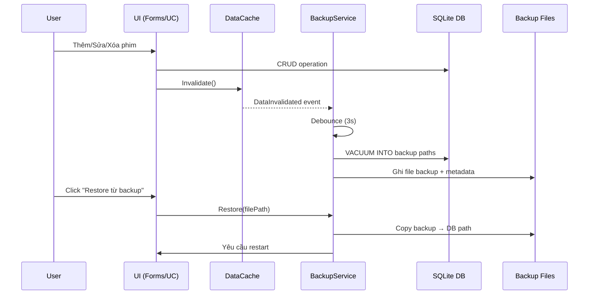

# Chức Năng Auto Backup Database

Thêm chức năng tự động backup database SQLite ra các đường dẫn mà user chọn. Khi user thêm/xóa/sửa dữ liệu (phim, audio, tag, playlist...), file backup sẽ được tự động cập nhật. User cũng có thể restore dữ liệu từ file backup.

## User Review Required

> [!IMPORTANT]
> **Cơ chế backup**: Tôi sẽ dùng SQLite `VACUUM INTO` để tạo bản sao database hoàn chỉnh (bao gồm tất cả tables: Movies, Audios, Tags, Playlists, MovieImages, MovieTags, AudioTags, PlaylistItems, AppSettings, Users). Đây là cách an toàn nhất và không bỏ sót dữ liệu nào.

> [!IMPORTANT]
> **Trigger backup**: Backup sẽ được trigger sau mỗi thao tác CRUD (Insert/Update/Delete) thông qua một event trung tâm `DataChanged` phát ra từ `DataCache`. Backup chạy trên background thread (debounce 3 giây) để không ảnh hưởng hiệu năng UI.

> [!WARNING]
> **Restore sẽ ghi đè toàn bộ database hiện tại**. User sẽ được cảnh báo rõ trước khi thực hiện. Sau khi restore, app sẽ cần restart.

## Proposed Changes

### Service Layer — BackupService

#### [NEW] [BackupService.cs](file:///d:/DEV/DEV_Source_Project/2.Develoment_Project/Person_Movie_Management_Winform/Person_Movie_Management/Services/BackupService.cs)

Service trung tâm quản lý toàn bộ logic backup:

- **Quản lý đường dẫn backup**: Lưu/load danh sách đường dẫn backup paths vào `backup_paths.json` (cùng thư mục app). Mỗi user có thể chọn **nhiều đường dẫn** backup riêng.
- **Backup database**: Dùng `VACUUM INTO` để tạo bản sao file `.db` tại mỗi đường dẫn. File backup sẽ có tên `AppDatabase_Backup.db`.
- **Debounce**: Khi data thay đổi liên tục (ví dụ batch import), sẽ đợi 3 giây trước khi thực sự ghi backup, tránh ghi quá nhiều lần.
- **Auto-backup trigger**: Subscribe vào event `DataCache.DataInvalidated` → trigger backup.
- **Restore**: Copy file backup ghi đè lên database gốc, yêu cầu restart app.
- **Backup info**: Mỗi file backup kèm metadata file (`AppDatabase_Backup.meta.json`) chứa: thời gian backup, user, version.

---

### Forms — FrmBackupManager

#### [NEW] [FrmBackupManager.cs](file:///d:/DEV/DEV_Source_Project/2.Develoment_Project/Person_Movie_Management_Winform/Person_Movie_Management/Forms/FrmBackupManager.cs)
#### [NEW] [FrmBackupManager.Designer.cs](file:///d:/DEV/DEV_Source_Project/2.Develoment_Project/Person_Movie_Management_Winform/Person_Movie_Management/Forms/FrmBackupManager.Designer.cs)

Form quản lý backup với các chức năng:

1. **Danh sách đường dẫn backup** (ListView/ListBox) — hiển thị tất cả đường dẫn đã chọn, trạng thái (✅ OK / ⚠️ Lỗi / Folder không tồn tại), thời gian backup gần nhất
2. **Nút "Thêm đường dẫn"** — mở `FolderBrowserDialog` cho user chọn folder
3. **Nút "Xóa đường dẫn"** — bỏ đường dẫn khỏi danh sách
4. **Nút "Backup ngay"** — trigger backup thủ công ngay lập tức
5. **Nút "Restore từ backup"** — mở `OpenFileDialog` cho user chọn file `.db`, xác nhận rồi restore
6. **Hiển thị trạng thái auto-backup**: Bật/tắt, thời gian backup lần cuối

UI sử dụng Guna2 controls, dark theme giống các form khác.

---

### Integration — Kết nối vào hệ thống hiện tại

#### [MODIFY] [DataCache.cs](file:///d:/DEV/DEV_Source_Project/2.Develoment_Project/Person_Movie_Management_Winform/Person_Movie_Management/Helpers/DataCache.cs)

- Event `DataInvalidated` đã tồn tại → `BackupService` sẽ subscribe vào đây.
- Đảm bảo `DataCache.Invalidate()` được gọi ở mọi nơi có CRUD (kiểm tra lại).

#### [MODIFY] [AppServices.cs](file:///d:/DEV/DEV_Source_Project/2.Develoment_Project/Person_Movie_Management_Winform/Person_Movie_Management/Services/AppServices.cs)

- Thêm `BackupService` vào singleton locator.

#### [MODIFY] [UcSidebar.Designer.cs](file:///d:/DEV/DEV_Source_Project/2.Develoment_Project/Person_Movie_Management_Winform/Person_Movie_Management/UserControls/UcSidebar.Designer.cs)

- Thêm nút `btnBackup` (💾 Sao lưu) vào sidebar, đặt trước nút Logout.

#### [MODIFY] [UcSidebar.cs](file:///d:/DEV/DEV_Source_Project/2.Develoment_Project/Person_Movie_Management_Winform/Person_Movie_Management/UserControls/UcSidebar.cs)

- Style nút `btnBackup` và handle click event.

#### [MODIFY] [FrmMain.cs](file:///d:/DEV/DEV_Source_Project/2.Develoment_Project/Person_Movie_Management_Winform/Person_Movie_Management/Forms/FrmMain.cs)

- Thêm case `"Backup"` trong `LoadPage()` → mở `FrmBackupManager`.
- Khởi tạo `BackupService` khi app start (sau login).
- Dừng backup service khi app đóng.

#### [MODIFY] [Program.cs](file:///d:/DEV/DEV_Source_Project/2.Develoment_Project/Person_Movie_Management_Winform/Person_Movie_Management/Program.cs)

- Không cần thay đổi. BackupService khởi tạo trong FrmMain sau khi user đã login.

---

## Flow Hoạt Động

## Verification Plan

### Automated Tests
- Build project: `dotnet build` để đảm bảo không lỗi compilation

### Manual Verification
1. Mở app → vào trang "Sao lưu" → thêm đường dẫn backup → xác nhận file backup được tạo
2. Thêm/sửa/xóa phim → kiểm tra file backup tự động cập nhật sau 3 giây
3. Xóa database → dùng Restore → kiểm tra dữ liệu khôi phục đúng
4. Thêm nhiều đường dẫn → kiểm tra backup ở tất cả đường dẫn
